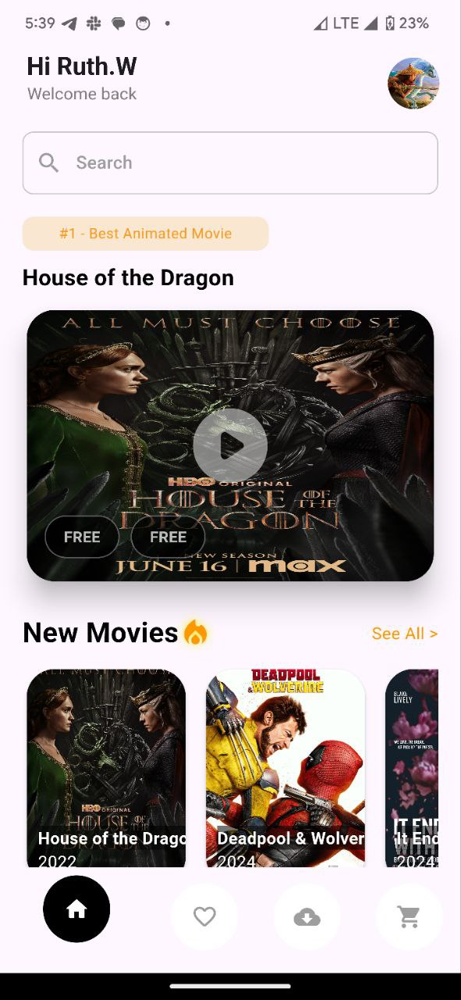
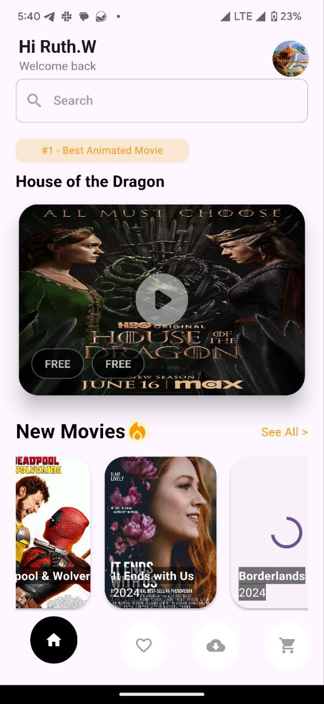
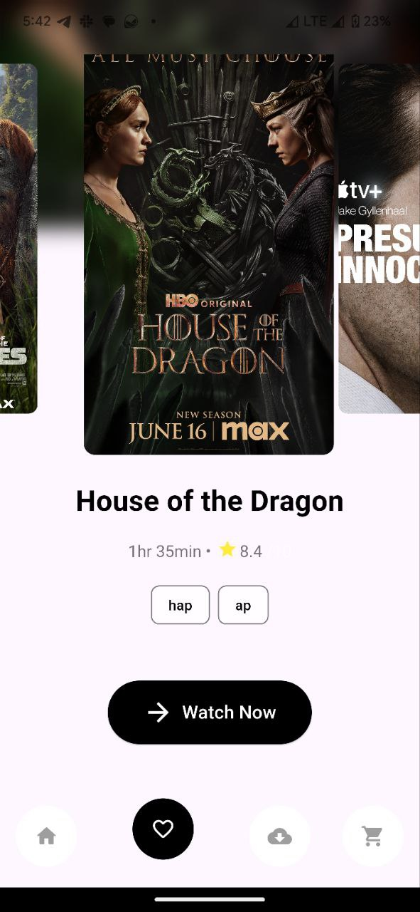
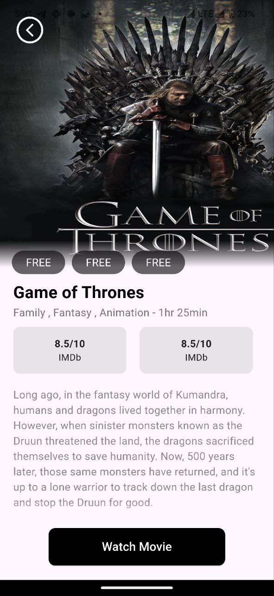
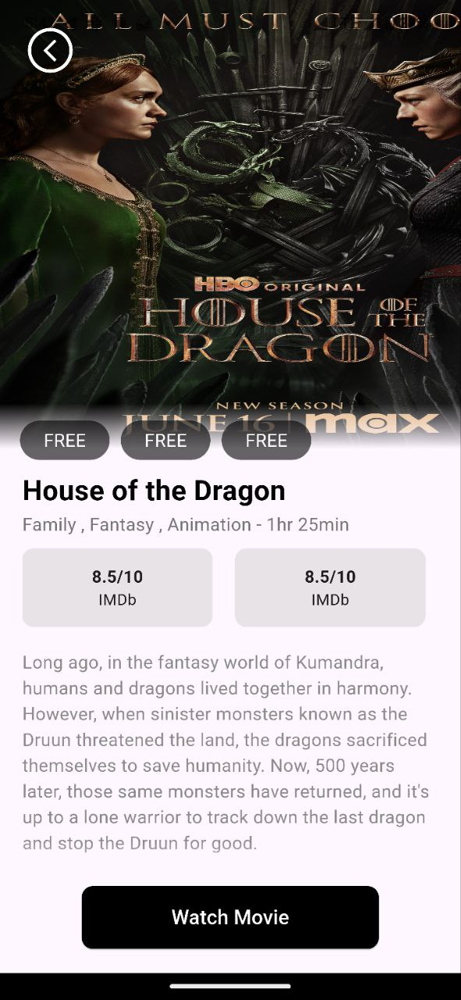

# Movie App

A Flutter project that allows users to browse and discover movies, view detailed information, and manage their favorites list. This app is built using clean architecture to ensure scalability and maintainability.

## Table of Contents
- [Overview](#overview)
- [Features](#features)
- [Architecture](#architecture)
- [Installation](#installation)
- [Usage](#usage)
- [Screenshots](#screenshots)
- [Contributing](#contributing)

## Overview
The Movie App is a mobile application that provides users with a seamless experience to explore a wide variety of movies. Users can search for movies, view detailed information including genres, ratings, and descriptions, and add their favorite movies to a favorites list.

This app leverages clean architecture principles, making it a scalable and maintainable solution for Flutter developers. It is designed with a modular structure that separates concerns and promotes code reusability.

Key technologies used:
- **Firebase Authentication**: Provides secure user authentication.
- **BLoC (Business Logic Component)**: Manages state throughout the app, ensuring a clear separation between business logic and UI components.

## Features
- **Movie Discovery**: Browse popular and top-rated movies.
- **Search**: Search for movies by title.
- **Movie Details**: View detailed information about a movie, including its genres, ratings, and overview.
- **Favorites**: Add movies to a favorites list for easy access.
- **Responsive UI**: The app is optimized for both mobile and tablet devices.

## Architecture
The app follows the principles of clean architecture, ensuring a clear separation of concerns between the UI, business logic, and data layers. This approach makes the app easier to test, maintain, and scale.

- **Presentation Layer**: Handles the UI and user interaction.
- **Domain Layer**: Contains business logic and use cases.
- **Data Layer**: Manages data retrieval from APIs and local storage.

The app uses BLoC (Business Logic Component) for state management, ensuring that the business logic is separate from the UI layer.

## Installation
To run this project locally, follow these steps:

1. **Clone the repository**:
   ```bash
   git clone https://github.com/yourusername/movie_app.git
   cd movie_app
Install dependencies:

bash
Copy code
flutter pub get
Run the app:

bash
Copy code
flutter run
Make sure you have Flutter installed and set up on your machine. For detailed instructions, refer to the official Flutter documentation.

Usage
Once the app is running, you can explore movies, search for your favorite titles, and manage your list of favorites. The user interface is intuitive, providing an easy-to-navigate experience.

Screenshots
Here are some screenshots of the app:

Home Screen




Favorites Screen



Movie Details Screen




Contributing
Contributions are welcome! If you have suggestions, bug reports, or feature requests, please open an issue or submit a pull request. Make sure to follow the contribution guidelines.


